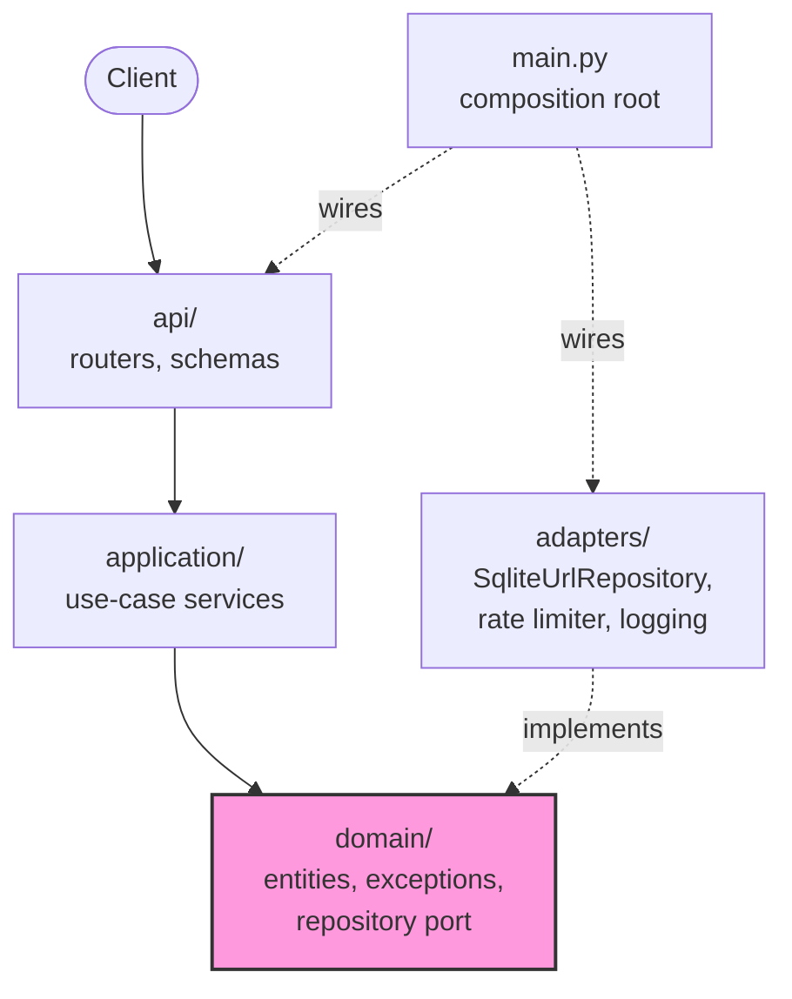
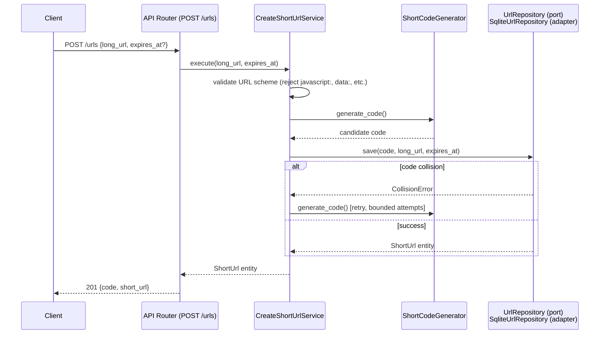
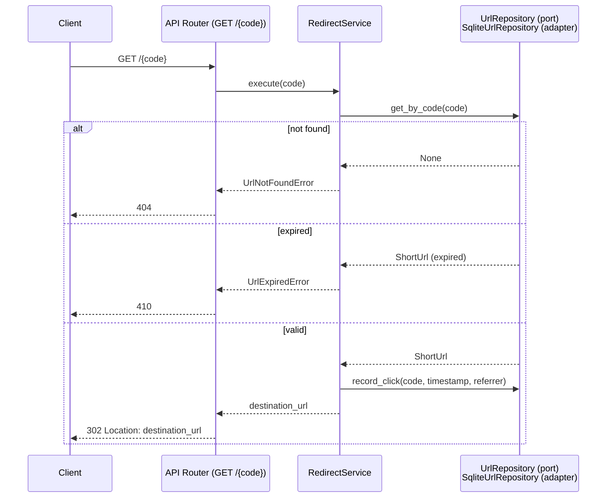

# Architecture

Clean Architecture / ports-and-adapters. Dependency rule: inner layers never
import outer layers. `domain` has no framework or database imports at all;
everything else depends inward toward it.

## Layers & Directory Structure

```
src/urlshortener/
  domain/            entities, domain exceptions, repository interfaces (ports)
  application/       use-case services: CreateShortUrl, Redirect, Stats, DeleteUrl,
                     ShortCodeGenerator
  adapters/          concrete implementations of domain ports: SqliteUrlRepository,
                     rate limiter, logging — the only layer allowed to import SQLite
                     or other external libraries
  api/               FastAPI routers, Pydantic request/response schemas,
                     exception -> HTTP status mapping
  main.py            composition root — wires concrete adapters into application
                     services via FastAPI Depends()
tests/
  unit/              domain + application tests, against an in-memory fake
                     repository (no SQLite involved)
  integration/        real SqliteUrlRepository + API tests via FastAPI TestClient
```

`adapters` (not `infrastructure`) is deliberate: it names this layer for what it
actually is — concrete implementations of the `domain` repository *port* — and
keeps `infrastructure` free for future IaC/Terraform without a naming clash.

## Dependency Flow



Only `main.py` (the composition root) knows both `application` and `adapters`
exist — routers and services never import a concrete adapter directly, only the
port they depend on.

## Request Flow — Create Short URL



## Request Flow — Redirect



Click recording happens synchronously, in the same request, before responding.
Chosen for correctness/simplicity in a single-instance prototype (NFR1); a
higher-throughput deployment would move this to an async/background write —
noted as a deliberate trade-off, not an oversight.

## Short Code Generation

- **Source**: `secrets.choice()` per character, backed by the OS CSPRNG
  (`os.urandom()`) — not the `random` module. This matters specifically because
  v1 has no auth: an unguessable code is the *only* access control on a
  mapping, so predictability (e.g. a PRNG whose internal state could be
  reconstructed from observed outputs) would be a real access-control gap, not
  just a theoretical one.
- **Alphabet**: base62 (`0-9A-Za-z`) — the densest URL-safe character set,
  avoiding the `+`/`/` escaping issues of base64.
- **Length**: 7 characters (~41.6 bits of entropy, ~3.5 trillion combinations).
  `secrets.choice()` draws each character with rejection sampling, so every
  character in the alphabet is exactly equally likely — a plain
  `random_byte % 62` would slightly favor 8 of the 62 characters, since 256
  isn't evenly divisible by 62.
- **Collision handling**: the insert relies on a DB unique constraint on
  `code`; on a constraint violation, the generator is retried (bounded, e.g. 5
  attempts). Collision probability is negligible at this length (birthday
  bound), but not assumed to be zero — a SELECT-then-INSERT existence check
  was rejected because it has a TOCTOU race under concurrent requests (two
  requests can both pass the check before either writes).

## Cross-Cutting Concerns

- **Error handling**: domain exceptions (`UrlNotFoundError`, `UrlExpiredError`,
  `CollisionError`, etc.) are translated to HTTP status codes in one place
  (`api/error_handlers.py`), keeping routers thin and free of HTTP-status logic.
- **Rate limiting**: in-memory token bucket per IP, applied to `POST /urls`
  (NFR4). Lives in `adapters/` since it's an external concern, not domain logic.
  Documented as not distributed-safe — acceptable per the single-instance
  Non-Goal, would need a shared store (e.g. Redis) to scale horizontally.
- **Observability**: structured logging for create/redirect/error events lives
  in `adapters/logging.py`, injected the same way the repository is.

## Extension Point — FR6 (Custom Aliases)

`CreateShortUrlService` is designed to later accept an optional `custom_code`
parameter and skip `ShortCodeGenerator` when present, relying on the same
repository uniqueness check for collision handling. Not implemented yet —
intentionally deferred to the ambiguous-requirement scenario (see PRD Section 8).

## Deferred Enhancements (documented now, built later if time allows)

Rate limiting (Phase 3) is the one brownfield enhancement scenario for this
project. The two decisions below are captured here so the reasoning is on
record, but are intentionally **not** implemented in the initial prototype —
additional scope only if time permits.

### Read-through cache for `getUrl`

- Introduced as a **decorator** around the read port (see below), e.g.
  `CachedUrlRepository`, implementing the same interface as
  `SqliteUrlRepository`. `RedirectService` depends only on the port, so it
  needs zero changes when the cache is added later — the actual payoff of the
  ports/adapters boundary.
- In-memory, TTL-based, single-instance — same distributed caveat already
  documented for the rate limiter.
- The risk that matters is **staleness, not performance**: a cached entry must
  be explicitly invalidated on delete (FR5) and on expiry (FR4). TTL alone
  would let a redirect keep resolving after the mapping is supposed to be gone.
- At prototype scale this isn't solving a real load problem; it demonstrates
  the reasoning and the architecture's ability to absorb the change without
  touching `application`/`domain`.

### Read/write interface segregation

- Split `UrlRepository` into two focused ports: `UrlReader` (`get_by_code`,
  `get_stats`) and `UrlWriter` (`save`, `delete`, `record_click`).
  `RedirectService`/`StatsService` would depend only on `UrlReader`;
  `CreateShortUrlService`/`DeleteUrlService` only on `UrlWriter`.
- Kept at the **interface level only** — one `SqliteUrlRepository` class still
  implements both ports, one database. Full CQRS (separate databases,
  replication, a write-propagation pipeline) is a scale solution this
  prototype doesn't need; documented as a future path, same pattern as NFR7's
  SQLite → Postgres note, not built.
- The two decisions compose: the cache decorator only needs to wrap
  `UrlReader` — writes always go straight to the database, never through a
  cache.

## Testing Strategy

- **Unit** (`tests/unit`): `application` and `domain` tested against a fake
  in-memory repository implementing the same port as `SqliteUrlRepository` —
  no database, no HTTP, fast.
- **Integration** (`tests/integration`): real `SqliteUrlRepository` against a
  temp SQLite file, plus full API tests via FastAPI's `TestClient`.

## Scalability Path (NFR7 — documented, not built)

This is a deliberately single-instance prototype (see PRD Non-Goals). This
section documents the credible path to scale, without building any of it —
building ahead of validated demand would be premature for a 2-3 day
prototype. Four things currently assume single-instance:

1. **SQLite is single-writer.** Create/delete/click-recording throughput is
   bounded by one writer at a time — fine at prototype load, a real ceiling
   under sustained concurrent write volume.
2. **The DB is a local file.** Multiple API instances can't safely share one
   SQLite file over a network filesystem — this alone is what forces
   single-instance today, more than the write-throughput point above.
3. **In-memory request counters (Phase 8) are per-process.** Each instance
   would maintain its own independent counts; there's no aggregation across
   instances.
4. **The in-memory rate limiter (Phase 9, once built) is per-process** for
   the same reason — running N instances would effectively multiply the
   real limit by N, since each enforces its own independent bucket.

**The path, if scale is ever actually needed:**

- **Storage**: migrate SQLite → a managed relational DB (e.g. Postgres).
  Because of the ports & adapters boundary, this touches *only*
  `adapters/sqlite_url_repository.py` (replaced by an equivalent adapter
  implementing the same `UrlRepository` port) — nothing in `domain` or
  `application` changes. Timestamps are already stored as ISO 8601 strings
  (`docs/SCHEMA.md`), which parse directly into Postgres's native timestamp
  columns.
- **Horizontal API scaling**: once storage is externalized (a shared DB, not
  a local file), the app becomes stateless per request and can run as N
  replicas behind a load balancer — *except* for the two in-memory pieces
  below, which would need to move first.
- **Rate limiting**: the in-memory token bucket would need a shared store
  (e.g. Redis) to enforce one real limit across instances rather than N
  independent ones. This will be called out explicitly as a known,
  accepted limitation when Phase 9 is built, not discovered later.
- **Counters**: similarly, would need either external aggregation (each
  instance's counters scraped and summed by the observability backend) or a
  shared counter store — not needed at single-instance scale.
- **Read-through cache** (Backlog #13, not built): same caveat — a shared
  cache (e.g. Redis) would be required for cache coherence and correct
  invalidation-on-delete/expiry across instances.

## Key Decisions & Rationale

| Decision | Rationale |
|---|---|
| Ports & adapters, not a framework-coupled service | Swapping SQLite for Postgres later touches only `adapters/`, nothing in `domain`/`application` (NFR6, NFR7) |
| `adapters/` name, not `infrastructure/` | Reserves `infrastructure/` for future IaC/Terraform; names the layer for its actual role (port implementations) |
| Click recording is synchronous | Correctness over throughput at prototype scale; documented trade-off, not an oversight |
| Bounded retry on code collision | Enforces NFR3 (collision-free) at write time rather than assuming randomness is sufficient |
| CSPRNG (`secrets`) random codes, not sequential/counter-based | Sequential codes are fully enumerable — walking `/1`, `/2`, `/3`... leaks every URL and total volume, conflicting with NFR4; random codes also avoid a centralized counter as a coordination point (NFR7) |
| Read-through cache deferred to a decorator, not built into `SqliteUrlRepository` | Keeps caching a swappable adapter concern; `RedirectService` needs zero changes when it's eventually added |
| `UrlRepository` split into `UrlReader`/`UrlWriter` ports (interface only, not full CQRS) | Interface segregation lets each service depend only on what it uses, and lets the cache wrap only reads, without the cost of separate databases this scale doesn't need |
